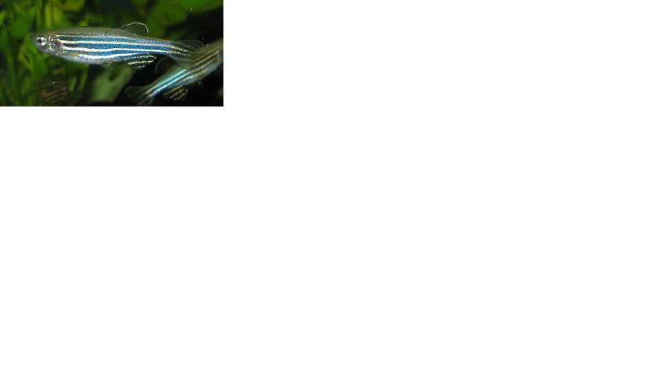
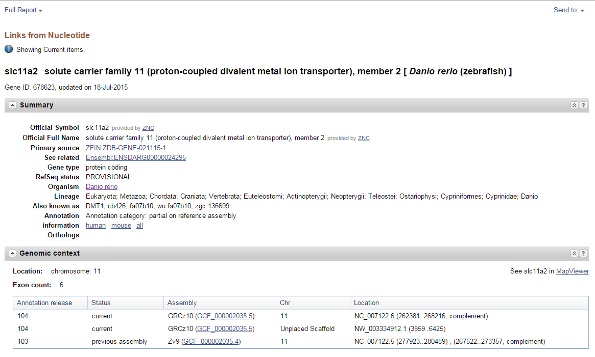
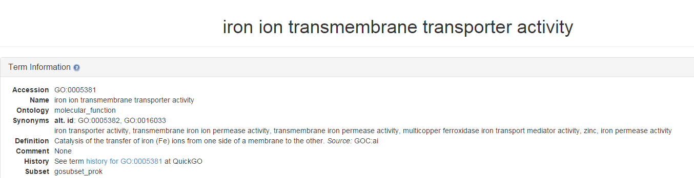

#My Exciting Gene

This page was created by Eugenio Carpizo-Ituarte

**Danio rerio divalent metal transporter 1 (dmt1) mRNA, complete cds**

**Zebra Fish**

**iron transporter activity, transmembrane iron ion permease activity, transmembrane iron permease activity, multicopper ferroxidase iron transport mediator activity, zinc, iron permease activity
Definition
Catalysis of the transfer of iron (Fe) ions from one side of a membrane to the other. Source: GOC:ai**

